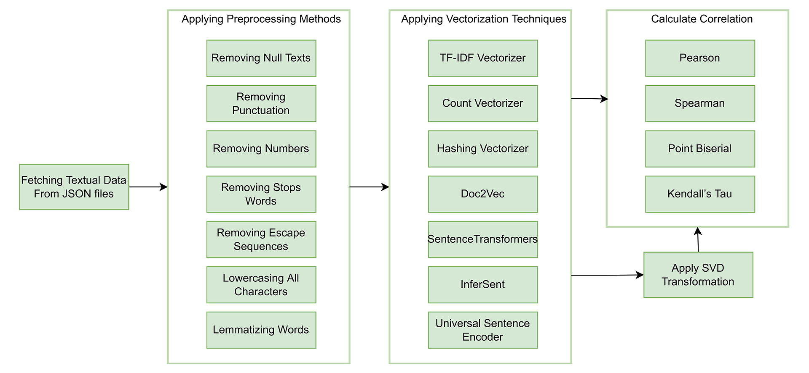

Applying Singular Value Decomposition on Paired Data
==============================
This is a submission of **assignment 2** for the **CIS726** course.

It contains the code necessary to conduct simple SVD transformation and inspect the resulting effects.

The dataset from the [eighth task](https://competitions.codalab.org/competitions/33835) in SemEval-2022 has been used.

Collaborators 🥇
------------
* Tariq Sha'ban
* Rand Agha
* Lujain Ghazalat

Getting Started
------------
Clone the project from GitHub

`$ git clone https://github.com/tariqshaban/svd-transformation.git`

No further configuration is required.

Usage
------------
Simply run the notebook on any IPython distro.

Methodology
------------
> 
>    
> The main operations conducted in this repository are thus:
> * Read the CSV file in order to acquire the JSON files ID, along with the true class.
> * Fetch the textual data based on the JSON ID.
> * Removing rows in which that have empty/null text values.
> * Discarding unnecessary columns.
> * Applying NLP methods, which should improve the results.
> * Vectorize both Deutsch and English texts, based on user-selected vectorization technique.
> * Calculate the similarity of the vectors.
> * Calculate the correlation between the founded similarity and the true class prior to the SVD transformation.
> * Perform the SVD transformation
> * Calculate the similarity of the vectors after the transformation.
> * Calculate the correlation between the founded similarity and the true class after the SVD transformation.
> * Repeat the steps while modifying the following:
>     * Vectorization technique
>     * Sigma percentile, which denotes the extent of the dimensionality reduction for the SVD
>     * Whether to perform NLP lemmatization or not
>     * Whether to normalize the vectors or not 
> * Observe each parameter's effect on the correlation.

Findings
------------
> **NOTE:** Bold numbers denote a relatively noticeable improvement

  
TF-IDF

| Method         |  Correlation Before  |  Correlation After  |
|:---------------|:--------------------:|:-------------------:|
| Pearson        |       0.037072       |      -0.057025      |
| Spearman       |      -0.033813       |      -0.073301      |
| Point Biserial |       0.037072       |      -0.057025      |
| Kendall’s Tau  |      -0.029307       |      -0.057911      |

[Documentation](https://scikit-learn.org/stable/modules/generated/sklearn.feature_extraction.text.TfidfVectorizer.html)

 

  
Count Vectorizer

| Method         |  Correlation Before  |  Correlation After  |
|:---------------|:--------------------:|:-------------------:|
| Pearson        |       0.030571       |      -0.093689      |
| Spearman       |       -0.03434       |      -0.100168      |
| Point Biserial |       0.030571       |      -0.093689      |
| Kendall’s Tau  |      -0.029663       |      -0.077723      |

[Documentation](https://scikit-learn.org/stable/modules/generated/sklearn.feature_extraction.text.CountVectorizer.html)

 

  
Hashing Vectorizer

|     Method     |  Correlation Before  |  Correlation After  |
|:--------------:|:--------------------:|:-------------------:|
|    Pearson     |       0.015116       |      -0.060267      |
|    Spearman    |       0.007608       |      -0.115777      |
| Point Biserial |       0.015116       |      -0.060267      |
| Kendall’s Tau  |       0.005918       |      -0.091439      |

[Documentation](https://scikit-learn.org/stable/modules/generated/sklearn.feature_extraction.text.HashingVectorizer.html)

 

  
Doc2Vec Vectorizer

| Method         |  Correlation Before  | Correlation After |
|----------------|:--------------------:|:-----------------:|
| Pearson        |      -0.017074       |     -0.133401     |
| Spearman       |       0.014611       |   **-0.220485**   |
| Point Biserial |      -0.017074       |     -0.133401     |
| Kendall’s Tau  |       0.011767       |   **-0.176767**   |

[Documentation](https://radimrehurek.com/gensim/models/doc2vec.html)

 

  
SentenceTransformers Vectorizer

| Method         |  Correlation Before  |  Correlation After  |
|----------------|:--------------------:|:-------------------:|
| Pearson        |      -0.082604       |      -0.111177      |
| Spearman       |      -0.087866       |      -0.070735      |
| Point Biserial |      -0.082604       |      -0.111177      |
| Kendall’s Tau  |       -0.06885       |      -0.059435      |

[Documentation](https://www.sbert.net)

 

  
InferSent Vectorizer

| Method         |  Correlation Before  | Correlation After |
|----------------|:--------------------:|:-----------------:|
| Pearson        |      -0.048277       |   **-0.232986**   |
| Spearman       |      -0.105281       |   **-0.258727**   |
| Point Biserial |      -0.048277       |   **-0.232986**   |
| Kendall’s Tau  |      -0.082398       |   **-0.202672**   |

[Repository](https://github.com/facebookresearch/InferSent)

 

  
Universal Sentence Encoder

| Method         |  Correlation Before  |  Correlation After  |
|----------------|:--------------------:|:-------------------:|
| Pearson        |      -0.105371       |       0.02989       |
| Spearman       |      -0.115516       |      -0.002465      |
| Point Biserial |      -0.105371       |       0.02989       |
| Kendall’s Tau  |      -0.090571       |      -0.00254       |

[Documentation](https://tfhub.dev/google/universal-sentence-encoder-multilingual/3)

Discussion
------------
After conducting the previous operations, we can conclude that:
* It appears that the correlations are negative in general, this is the expected behaviour since the true class is
  descending. Refer to the
  [SemEval-2022 eighth task data description](https://competitions.codalab.org/competitions/33835#learn_the_details-timetable);
  the website states: `This is a document-level similarity task in the applied domain of news articles,
  rating them pairwise on a 4-point scale from most to least similar`.
* The SVD transformation generally increased the correlation in different proportions,
  depending on the vectorization technique.
* The `Universal Sentence Encoder` transformation has negatively affected the correlation, due to the fact that the
  resulting vectors already project on the same dimensionality, hence, 
  finding the similarity does not require any transformation. Refer to [this notebook](https://colab.research.google.com/github/tensorflow/hub/blob/master/examples/colab/cross_lingual_similarity_with_tf_hub_multilingual_universal_encoder.ipynb).
* It can be concluded that the `InferSent` vectorization technique obtained the highest correlation.

Notes
------------
* The correlation results are inconsistent, and liable to marginal change; due to seeding and randomization.
* Although the correlation has improved after the transformation, the results are generally poor and should not be
  trusted, further investigation is required.
* `Universal Sentence Encoder` is implemented on `TensorFlow`, it is recommended to capitalize the GPU resources; to
  result in an efficient execution.

--------
